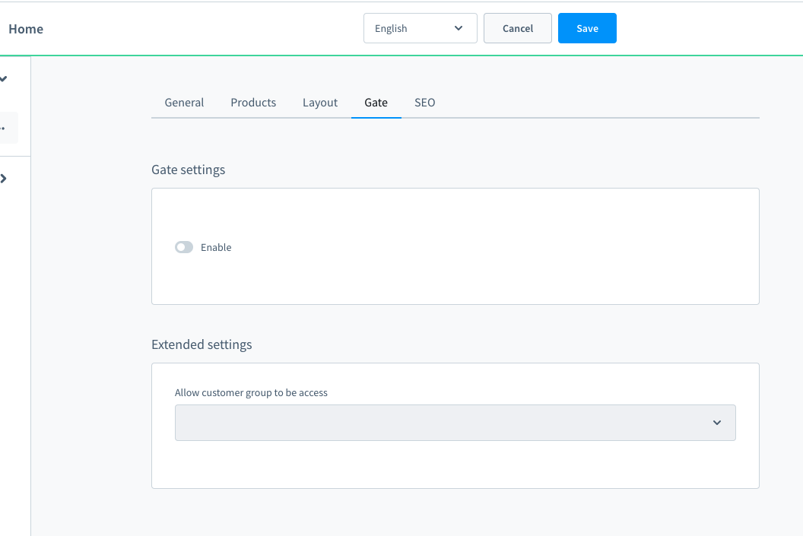
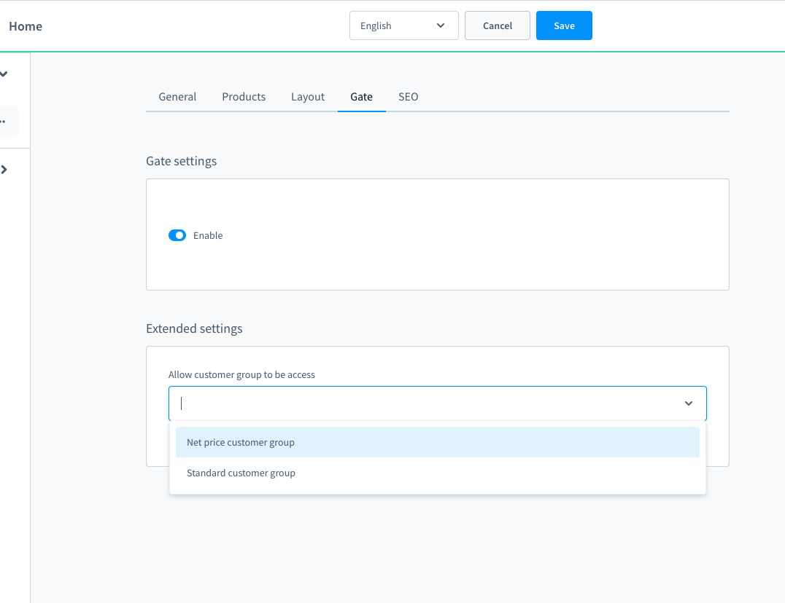

# Shopware 6 Login required for the categories
This plugin is supporting to check the logged-in status before the users access a category

After installing this plugin, you can find the setting on the gate tab on the category detail page

In the gate settings card if you switch to enable means the users who aren't logged in can't access this category

Besides, when you switch to enable you can add the customer groups able to access this category, users in other groups will not be able to access it.
